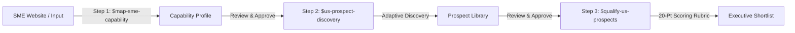

# SG Semicon US Expansion


> **SBF-Aligned US Market-Entry Prospecting & Decision Support for Singapore Semiconductor SMEs**

This Codex plugin helps Singapore Business Federation (SBF) leaders and Singapore semiconductor-supply-chain SMEs answer three practical questions:

1. **What can this SME credibly offer the US semiconductor market?**
2. **Which US companies, projects, and market-entry routes may be relevant?**
3. **Which opportunities deserve priority, and how can SBF help?**

The plugin produces evidence-backed decision support. It does not replace commercial due diligence or guarantee that a company will become a customer.

---

## Quick Reference

| Stage | Command / Trigger | Primary Action | Output |
| :--- | :--- | :--- | :--- |
| **Step 1** | `$map-sme-capability <URL / File>` | Map SME core capabilities, evidence & limitations | `output/<sme>/01_capability_profile.md` |
| **Step 2** | `$us-prospect-discovery` | Discover relevant US prospects across target clusters | `output/<sme>/prospects/*.md` |
| **Step 3** | `$qualify-us-prospects` | Score & rank top candidates using 20-pt rubric | `output/<sme>/03_qualified_shortlist.md` |

---

## Installation

1. Open **Plugins** in Codex.
2. Select **Add more** from the marketplace dropdown.
3. Add the plugin folder or repository URL.
4. Start a new Codex task after installation.

---

## Deliverables

For each SME, the workflow generates:

- **Capability Profile (`01_capability_profile.md`)**: A structured summary of core technical offerings, website evidence, and operational limits.
- **Prospect Library (`prospects/*.md`)**: A persistent collection of individual Markdown records for screened US prospects, market-entry partners, and ecosystem connectors.
- **Qualified Executive Shortlist (`03_qualified_shortlist.md`)**: A prioritized 5–8 candidate decision report featuring component scores, buyer routes, next verification questions, and recommended SBF actions.

---

## Target Segment & Scope

### Designed For
- **SBF Leaders & Advisors**: Evaluating strategic support initiatives for Singapore SMEs entering the US semiconductor ecosystem.
- **Singapore SME Executives**: Assessing potential US customers, partners, and expansion routes.
- **Industry Partners**: Guiding SMEs through market validation, missions, and establishment.

### Eligible Sector Focus
Target SMEs should be Singapore-owned (≥30% local equity, revenue < SGD 100M, <200 employees). Relevant activities include:

- Semiconductor equipment & precision engineering
- Testing, assembly & advanced packaging
- Cleanroom, facility services & tool relocation
- Factory software, logistics & systems integration

*Note: Direct semiconductor manufacturing (Fab operations) is out of scope.*

---

## Workflow Architecture



### 1. Capability Mapping (`$map-sme-capability`)
Analyzes the SME’s website or company presentation to identify up to three core capabilities, supporting evidence, and search keywords for US discovery.

### 2. Prospect Discovery (`$us-prospect-discovery`)
Runs adaptive search cycles across priority US clusters using public signals (CHIPS Act awards, state EDO announcements, company career portals, contractor listings). Generates individual prospect records categorized as:
- **Commercial Prospect**: Potential buyers or end-customer projects.
- **Route-to-Market Partner**: OEMs, EPCM contractors, integrators providing buyer access.
- **Ecosystem Connector**: EDOs, industry chambers, research consortia.

### 3. Prospect Qualification (`$qualify-us-prospects`)
Screens the prospect library against a 20-point rubric assessing capability fit, timing signals, buyer accessibility, and evidence strength. Recommends specific SBF engagement stages (**Learn**, **Lead Generation**, **Land**, **Localize**).

---

## Optional Inputs

Users can supply context in `input/existing_customers.md` to exclude current accounts or guide analogous-buyer searches:

```markdown
# Existing Customers - [SME Name]

- Customer A (US - Texas)
- Customer B (Singapore / SEA Subsidiary)

Exclusions:
- Exclude direct outreach to existing Tier-1 fab accounts in Taiwan.
```

---

## Geographic Focus

Default priority US semiconductor clusters:
1. **Central Texas** (Austin, Taylor, Round Rock)
2. **Arizona** (Phoenix, Chandler)
3. **New York** (Albany, Marcy, Fishkill)

Other US regions are evaluated when capability fit or timing signals are exceptionally strong.

---

## Human Review & Natural Language Feedback

The workflow stops for review after every step. Users can revise assumptions or scope in plain English:

```text
- "Add flip-chip packaging as a user-specified search term."
- "Focus search on Arizona partners rather than fab owners."
- "Move Candidate X to Watchlist due to unclear buyer route."
```

---

## Working Files

All outputs are saved in self-contained folders under `output/<sme_name>/`:

- `01_capability_profile.md`: Step 1 capability summary.
- `02_search_log.md`: Log of discovery queries and reflections.
- `02_prospects_index.tsv`: Lightweight speed index.
- `prospects/*.md`: Detailed records for each discovered prospect.
- `03_qualified_shortlist.md`: Final qualified executive report.
- `03_qualified_shortlist.json`: Structured archive of shortlisted candidates.

---

## Limitations & Disclaimers

> **Decision Support Only**: Reports generated by this plugin provide evidence-backed research and market discovery. They do not replace formal commercial due diligence, legal counsel, or financial audits.

- **Public Data Dependency**: Prospect discovery is built strictly on open, publicly accessible web signals and public announcements. It does not access private databases or non-public procurement registries.
- **Export Control Disclaimer**: The plugin does not perform compliance reviews under US Export Administration Regulations (EAR) or ITAR. Users must independently verify regulatory compliance before commercial outreach.
