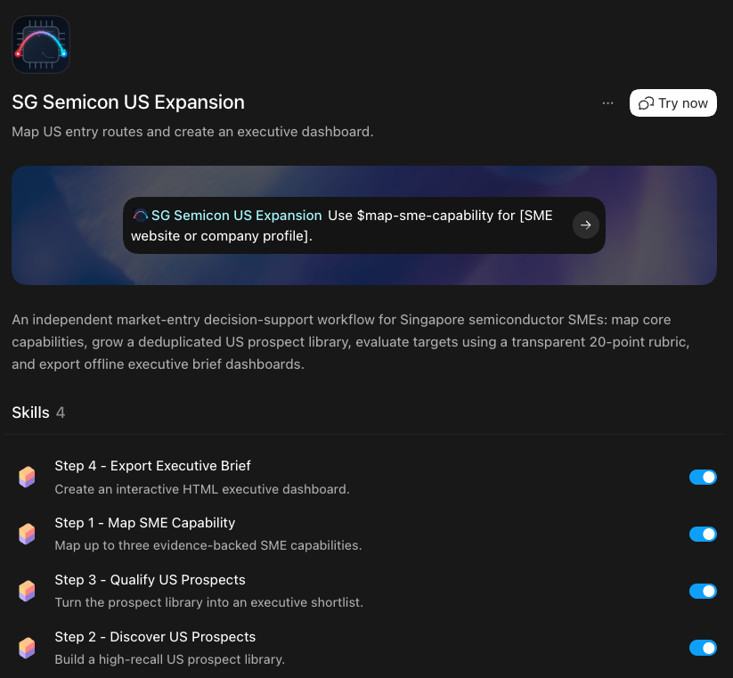
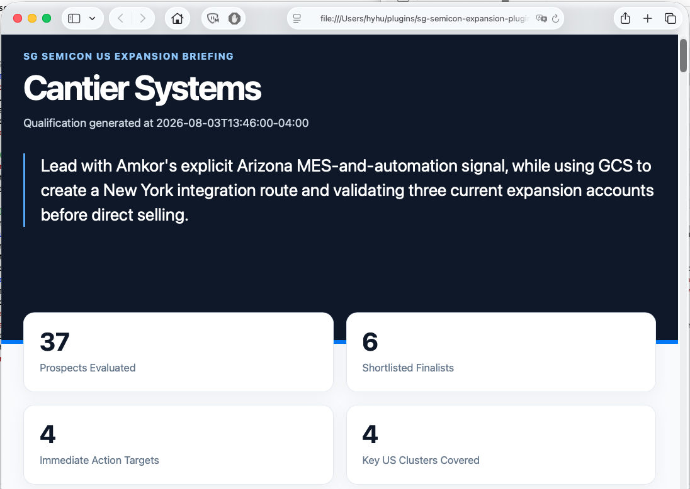
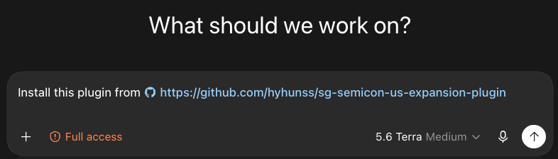

# Singapore Semiconductor US Expansion

> Evidence-backed market-entry decision support for Singapore semiconductor SMEs and the advisors who support them.

## The decision this plugin supports

Entering the U.S. semiconductor ecosystem is not a question of finding the largest fabs. It is a question of choosing a credible first route: **which organizations matter, why the SME fits, how accessible the route is, and what to verify before committing resources.**

This Codex plugin turns public evidence into a reviewable decision path. It maps what an SME can credibly offer, builds a persistent library of relevant U.S. buyers and access routes, narrows that library through a transparent rubric, and produces an executive-ready brief.

The repository supports the Agent Plugins v1.0.0 portable format for skills, while retaining its Codex-native manifest and installation flow.

### Portable package layout

The root [plugin.json](plugin.json) is the single portable Agent Plugins v1.0.0 manifest. Each workflow is an Agent Skill in `skills/<skill-name>/SKILL.md`, so compatible clients can discover the four skills from the standard fixed location. The plugin has no MCP server, so it intentionally does not include `mcp.json`.

The `.codex-plugin/plugin.json` file is retained only for Codex-native distribution and does not replace the portable root manifest.

### Built into Codex

The workflow is available as one focused Codex plugin, ready to begin from an SME website or capability profile.



### From evidence to an executive brief



## What leaders receive

| Decision artifact | Leadership use | What it contains |
|---|---|---|
| **Capability profile** | Establish the market-entry premise | Core competencies, sourced evidence, and targeting vectors |
| **Prospect library** | Build a broad, reusable option set | Individual OKF v0.2 records for buyers, route partners, and ecosystem connectors |
| **Qualified shortlist** | Decide where to focus | 5–8 targets, transparent 20-point scores, practical buyer paths, and critical unknowns |
| **Executive dashboard** | Align action and review | A self-contained, print-ready brief of priorities, evidence, and next actions |

The output is decision support—not a claim that a target will buy, a substitute for customer conversations, or a regulatory assessment.

## How it works


| Step | Command | Decision purpose |
|---|---|---|
| 1. Map | `$map-sme-capability <website or profile>` | Define only the capabilities public evidence supports. |
| 2. Discover | `$us-prospect-discovery` | Build and extend a capability-relevant U.S. prospect library. |
| 3. Qualify | `$qualify-us-prospects` | Compare candidates on fit, timing, route, accessibility, cluster, and evidence. |
| 4. Brief | `$export-executive-brief` | Prepare the approved shortlist for executive review. |

The workflow is intentionally review-gated. If discovery adds candidates, rerun qualification and then export so the brief reflects the current library.

## What makes the approach different

- **Route before scale.** It considers direct owners alongside equipment OEMs, EPC and cleanroom routes, integrators, universities, consortia, and economic-development connectors.
- **Evidence before narrative.** Each capability profile and prospect is an OKF v0.2 Markdown concept with source-linked claims and explicit caveats.
- **High recall, then high precision.** Discovery preserves plausible options; qualification owns filtering, scoring, and action recommendations.
- **Business intelligence, not schema theatre.** Metadata stays minimal. The useful information—why a target matters, what the source establishes, and what remains unknown—stays in readable Markdown.

## Intended users and scope

Designed for:

- Singapore semiconductor-supply-chain SMEs assessing a U.S. market-entry route.
- SBF advisors and programme leaders deciding where to focus market-development support.
- Partners supporting validation, introductions, missions, or localization.

The workflow is most useful for equipment and precision engineering, test, assembly and advanced packaging, cleanroom and facility services, tool relocation, factory software, logistics, and systems integration. It does not perform export-control, legal, tax, or customer qualification due diligence; those decisions require appropriate professional and commercial validation.

Default discovery emphasizes Central Texas, Arizona, and New York, while admitting stronger evidence from other U.S. regions.

## Before you start

Provide one reliable SME source: a website, capability deck, or company profile. The first step will turn demonstrated capabilities and hard evidence into focused targeting vectors.

Optionally add `input/existing_customers.md` to exclude named accounts or prevent unwanted group-level duplicates during discovery.

```markdown
# Existing Customers - [SME Name]

- Customer A (US - Texas)
- Customer B (Singapore / SEA subsidiary)

Exclusions:
- Exclude direct outreach to existing Tier-1 fab accounts in Taiwan.
```

## Output and governance

Each SME has a self-contained workspace under `output/<sme_name>/`:

```text
01_capability_profile.md       Evidence-bounded capability premise
index.md                       OKF entry point
prospects/                     Canonical OKF prospect records and their index
02_search_log.md               Reproducible discovery history
02_prospects_index.tsv         Rebuildable screening index
03_qualified_shortlist.md      Leadership decision brief
03_qualified_shortlist.json    Canonical structured shortlist
04_executive_dashboard.html    Offline executive dashboard
```

The capability profile and prospect records follow OKF v0.2. Search logs and TSV indexes support workflow execution; they do not replace the canonical evidence-bearing records.

## Installation

### Install through chat

Open a Codex chat and paste:

```text
Install this plugin from https://github.com/hyhunss/sg-semicon-us-expansion-plugin
```

Confirm the installation, then start a new task and invoke `$map-sme-capability` with an SME website or profile.



### Alternative: install from the Plugins menu

Open **Plugins** in Codex, select **Add more**, and add this local folder or repository URL.

## Evidence boundaries

- Discovery uses open, public sources. It does not access private procurement systems or non-public databases.
- A project announcement is not proof of a purchase requirement or supplier approval.
- A target's inclusion is a hypothesis worth validating, not a commercial recommendation or endorsement.
- Verify export controls, sanctions, data handling, procurement rules, and commercial eligibility independently before outreach or commitment.
