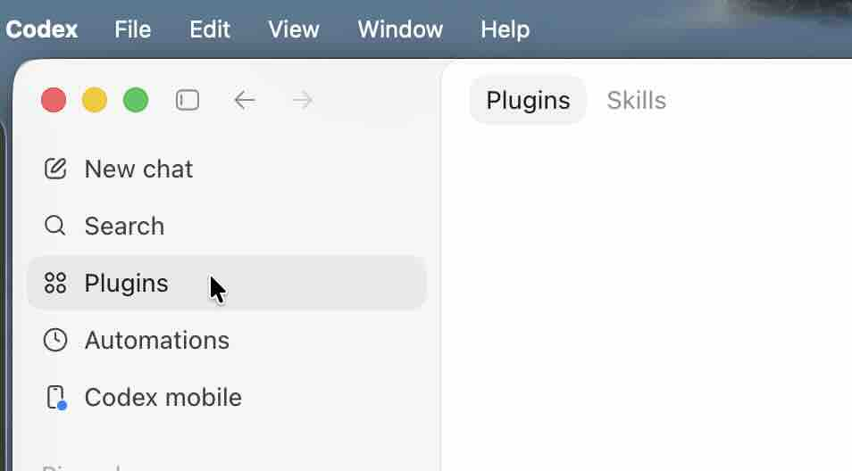
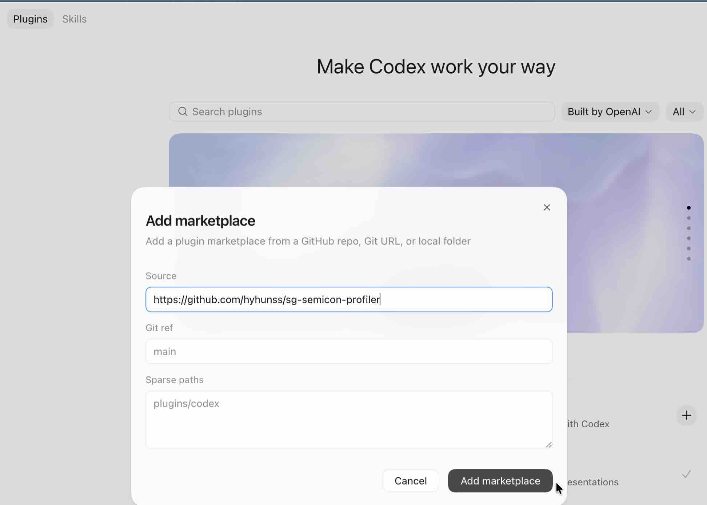

# Singapore Semiconductor Profiler

This Codex plugin turns one Singapore semiconductor or semiconductor-adjacent company URL into one validated row in a project-local workbook:

```text
data/companies.xlsx
```

The plugin is intentionally small and production-minded. The AI researches the website and returns one JSON object. The bundled Python script validates the JSON, normalizes domains, prevents duplicate workbook rows, and writes the Excel file.

## What it does

- Checks whether a company domain already exists before research starts.
- Keeps stale rows in place until a validated replacement profile is ready.
- Rejects malformed JSON, mismatched website/domain values, and legacy fields.
- Requires multi-page evidence for high-confidence company profiles.
- Records evidence URLs, an evidence summary, and research quality for auditability.
- Writes only inside the current project root.
- Saves workbook updates through a temporary file before replacing the final workbook.

## Requirements

Use Python 3.11 or newer. The Python dependencies are declared in `pyproject.toml`:

```bash
uv sync
```

The main runtime dependencies are `openpyxl` and `pydantic`.

## Usage

From a Codex thread in the project you want to update:

```text
Use $singapore-semiconductor-profiler to profile https://example.com.sg into data/companies.xlsx
```

The expected workflow is:

1. The skill checks the normalized domain in `data/companies.xlsx`.
2. If the domain is fresh, it stops with `already exists`.
3. If the domain is missing or stale, Codex researches the company website.
4. Codex reviews the most relevant available pages and builds evidence coverage.
5. Codex emits one schema-valid JSON profile.
6. The bundled Python script validates and upserts the row.

## Evidence quality

The workbook stores:

- `evidence_url`: the strongest source URL.
- `evidence_urls`: 1-5 reviewed URLs, stored as newline-separated links in Excel.
- `evidence_summary`: a short explanation of what the sources support.
- `research_quality`: one of `complete`, `limited_site`, `thin_evidence`, `inaccessible_site`, or `conflicting_sources`.

High-confidence rows require at least 3 distinct company-site evidence URLs and `research_quality = complete`. Existing fresh rows that lack the new evidence fields are automatically sent back through research instead of being skipped. If a website is thin, blocked, or contradictory, the profile should use medium or low confidence and explain the limitation.

For local validation:

```bash
export SKILL_DIR="skills/singapore-semiconductor-profiler"
uv run python "$SKILL_DIR/scripts/smoke_test_company_profile.py"
uv run python "$SKILL_DIR/scripts/company_profile_excel.py" validate "$SKILL_DIR/references/sample_company_profile.json"
uv run python "$SKILL_DIR/scripts/company_profile_excel.py" audit
```

## Troubleshooting

- `already exists`: the normalized domain is already present and was checked within the last 90 days.
- `missing evidence fields`: the row exists but predates the evidence-led schema, so it should be refreshed.
- `stale row retained until replacement`: the existing row is old enough to refresh, but it has not been deleted before replacement.
- `high confidence requires at least 3 company-site evidence_urls`: collect more relevant company-site pages or lower confidence and mark the appropriate research-quality limitation.
- Validation errors: remove unsupported keys such as `country`, `semicon_category`, or `status`; they are legacy workbook columns, not accepted JSON fields.
- Workbook path errors: keep `COMPANIES_XLSX` relative to the project root, such as `data/companies.xlsx`.

## Install

1. Open Codex and click the "Plugins" tab. 

2. Click "Add more". 

3. Paste the GitHub URL into the "Source" and click "Add marketplace". 

4. Start using the plugin. Use a capable reasoning model because the research step requires judgment about semiconductor relevance and buyer fit.
